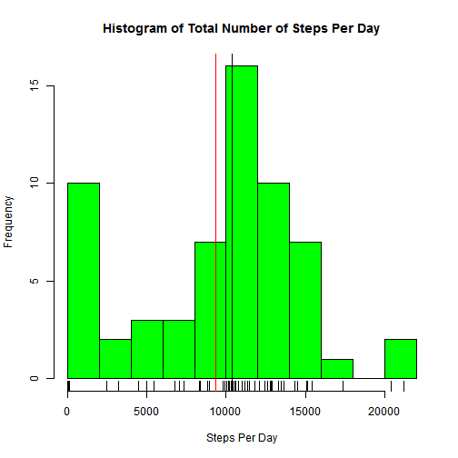
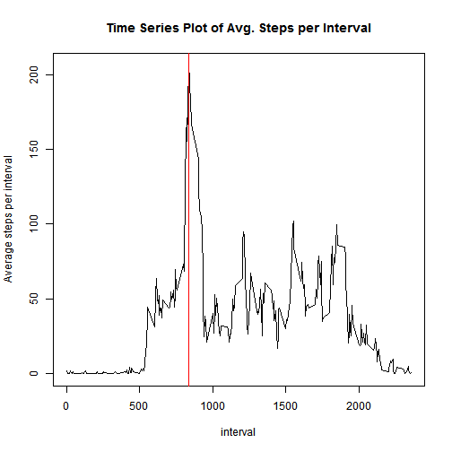
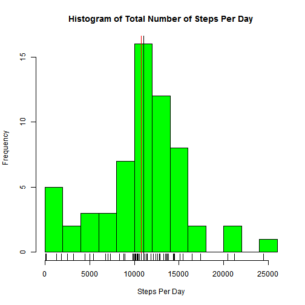
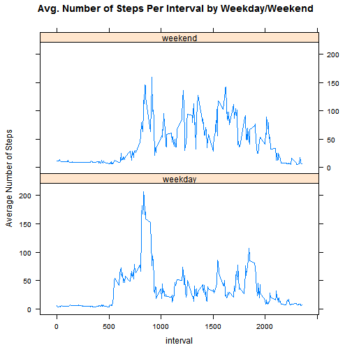

  
  **ACTIVITY MONITORING ANALYSIS ASSIGNMENT**

This assignment makes use of data from a personal activity monitoring device ([Coursera Class][1]). This device collects data at 5 minute intervals through out the day. The data consists of two months of data from an anonymous individual collected during the months of October and November, 2012 and include the number of steps taken in 5 minute intervals each day.

This assisgnment consists of 5 parts that are performed below:

**1) Loading and preprocessing the data:**
**Data is loaded from a zip file which already comes in tidy data frame format.**


```r
data <- read.csv(unz("activity.zip", "activity.csv"))
```

**2) Finding mean of total number of steps taken per day:**  
**In this step an histogram of total number of steps per day is created.**
**Mean and Median is shown below the histogram.**  


```r
#Subset sum of Steps per day by date
stepsperday<-aggregate(data$steps,data["date"],sum,na.rm=TRUE)

#A histogram is created showing mean(red) and median(black) as vertical lines
hist(stepsperday[[2]],breaks=15,col="green",xlab="Steps Per Day",main="Histogram of Total Number of Steps Per Day")
med_val<-median(stepsperday[[2]],na.rm=TRUE)
abline(v=med_val,col="black")
mean_val<-mean(stepsperday[[2]],na.rm=TRUE)
abline(v=mean_val,col="red")
rug(stepsperday[[2]])
```

 

  **Median of the steps taken per day is: 10395 (black line)**  
  **Mean of the steps taken per day is: 9354.2295 (<span style="color:red">red</span> line) **


**3) Finding the average daily activity pattern:**  
**In this step a time-series plot is created showing the average steps per interval.**  
**The interval of when the maximum number of steps occur is shown below the plot.**


```r
#Subset average of Steps per day by interval
avgstepsperint<-aggregate(data$steps,data["interval"],FUN=mean,na.rm=TRUE)
#Create a time-series plot
plot(avgstepsperint,type="l",ylab="Average steps per interval",main="Time Series Plot of Avg. Steps per Interval")
#Calculate and display the interval the average steps peakes its maximum value 
max_steps<-max(avgstepsperint[[2]])
max_int<-as.numeric(avgstepsperint[which.max(avgstepsperint[[2]]),][1])
abline(v=max_int,col="red")
```

 
  
  **Maximum steps taken per interval is: 206.1698**  
  **This number is reached at interval: 835 identified by the <span style="color:red">red</span> line**  


**4a) Imputing missing values:**
**A simple method of taking the mean values of 5-minute intervals is used to fill in the missing NAs.**  


```r
#Number of rows with missing values are calculated
na_count<-nrow(data[is.na(data$steps)==TRUE,])
#Create a copy and impute NAs
data_copy<-data
data_na<-data[is.na(data$steps)==TRUE,]
data_avgintv<-aggregate(data$steps,data["interval"],FUN=mean,na.rm=TRUE)
merged_d1d2<-merge(data_na,data_avgintv)
data_copy[is.na(data$steps)==TRUE,1]<-merged_d1d2$x
```

**There were a total of <span style="color:red">2304</span> NAs before the imputing process. **


**4b) Creating the histogram of the data with corrected NAs:**  
**The histogram is re-created using the data created in the "imputing NAs" step.**  
**The new median and mean are shown below the histogram.**  
**It is observed that imputing the NAs normalized the data.**  


```r
#Subset sum of Steps per day by date
stepsperday<-aggregate(data_copy$steps,data_copy["date"],sum,na.rm=TRUE)

#A histogram is created showing mean(red) and median(black) as vertical lines
hist(stepsperday[[2]],breaks=15,col="green",xlab="Steps Per Day",main="Histogram of Total Number of Steps Per Day")
med_val<-median(stepsperday[[2]],na.rm=TRUE)
abline(v=med_val,col="black")
mean_val<-mean(stepsperday[[2]],na.rm=TRUE)
abline(v=mean_val,col="red")
rug(stepsperday[[2]])
```

 

  **Median of the steps taken per day is: 1.1015 &times; 10<sup>4</sup> (black line)**  
  **Mean of the steps taken per day is: 1.0766 &times; 10<sup>4</sup> (<span style="color:red">red</span> line)** 

**The overall impact of imputing missing data resulted in:**  
i)an increase in both median and mean.  
ii)closed the gap between mean and median "normalizing" the distribution.  
  
  
**5) Are there differences in activity patterns between weekdays and weekends?:**
**It is observed that people tend to be active early on in the day**  
**on weekdays compared to weekends. However, overall people are more active in the weekends.**  


```r
#Subset sum of Steps per day by date
library(lubridate)
data_copy$weekday<-weekdays(ymd(data_copy$date))

weekday<-c("Monday","Tuesday","Wednesday","Thursday","Friday")
weekend<-c("Saturday","Sunday")
data_copy[data_copy$weekday %in% weekday==TRUE,]$weekday<-"weekday"
data_copy[data_copy$weekday %in% weekend==TRUE,]$weekday<-"weekend"
data_copy$weekday<-as.factor(data_copy$weekday)
data_avgbyw<-aggregate(data_copy$steps,by=list(data_copy[["interval"]],data_copy[["weekday"]]),FUN=mean)
data_avgbyw <- setNames(data_avgbyw,c("interval", "weekday","avg_steps"))
#Create the panel plot
library(lattice)
xyplot(avg_steps~interval|weekday,data=data_avgbyw,layout=c(1,2),ylab="Average Number of Steps",main="Avg. Number of Steps Per Interval by Weekday/Weekend",type="l")
```

 

**Summary**
**By analysing the activity monitoring data it is observed that:**  
i)People tend to be more active at certain time intervals during each day.  
ii)The activity trends are different between weekends vs weekdays.  
iii)The activity tends to represent a normal distribution with an average of ~11K steps/day.  
iv)The average steps per interval peaks for interval 835 ,with 206.1698 steps.   


**Author: Necati Arin Keskin**  
**Date: November 15 2014**  

[1]: http://www.coursera.com "Coursera Reproducible Research Class.Peer assignment 1"
